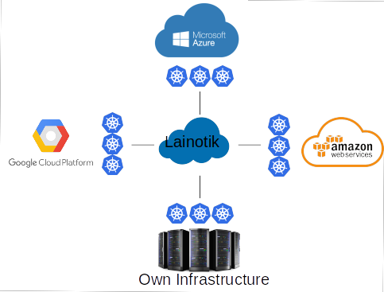
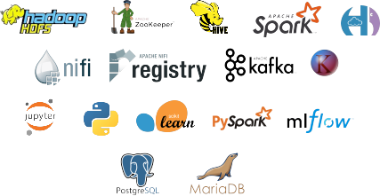

# Lainotik Documentation and Snippets

Here you will find snippets and documentation related to the use of the Lainotik Bigdata/ML IIOT platform. Its goal is to provide all the information required to make an efficient use of the platform.

Lainotik provides BigData/ML IIOT services on Kubernetes (also referred as K8s), therefore it can work with any Kubernetes provider:

Lainotik simplifies the setup of Bigdata services on any Kubernetes to "just one click". All the bigdata services are fully integrated and ready to use with minimal configuration:

Lainotik monitores all the Bigdata/ML services with the "the facto" monitoring tools for Kubernetes:

Scaling of the bigdata services is facilitated by the Lainotik platform deploying automatically the requested resources with "just one click", allowing the management of the resources to cover the business needs at the lower cost.

Simplicity to operate with Bigdata/ML tools is the aim of the Lainotik platform.

